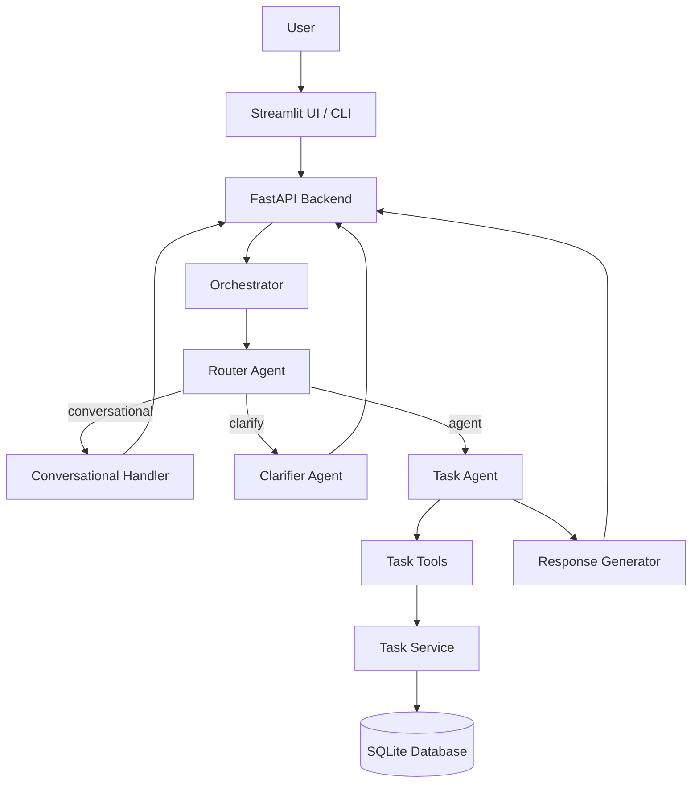
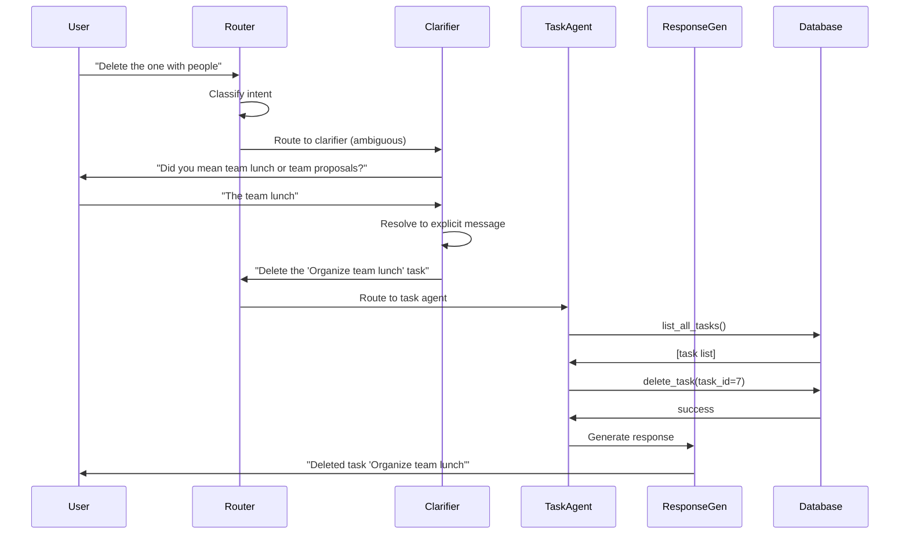
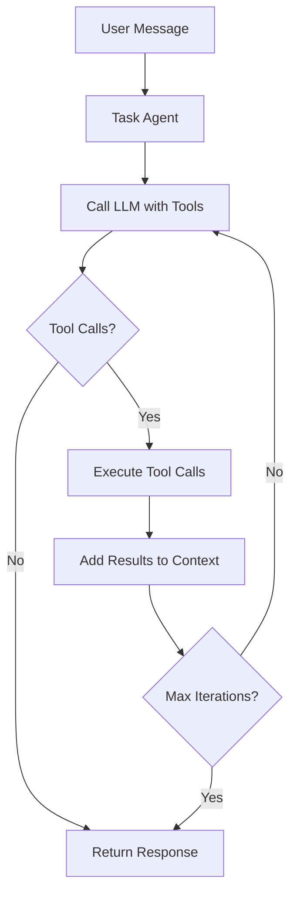

# Milo - AI Task Manager

A production-ready task management system powered by a multi-agent AI architecture. The system uses OpenAI's function calling API to provide natural language task management through a conversational interface.

## Table of Contents

- [Overview](#overview)
- [Architecture](#architecture)
- [Getting Started](#getting-started)
- [Running the Application](#running-the-application)
- [Project Structure](#project-structure)
- [System Components](#system-components)
- [API Reference](#api-reference)
- [Development](#development)
- [Configuration](#configuration)

## Overview

Milo is an intelligent task management system that allows users to manage tasks through natural conversation. The system employs a multi-agent architecture where specialized agents handle different aspects of the conversation: intent classification, ambiguity resolution, task execution, and response generation.

### Key Features

- **Multi-Agent Architecture**: Specialized agents for routing, clarification, task execution, and response generation
- **Natural Language Interface**: Conversational task management without rigid command syntax
- **Context Awareness**: Maintains conversation history to resolve implicit references
- **Temporal Intelligence**: Understands relative date expressions (tomorrow, next week, in 3 days)
- **Agentic Loop**: Automatically chains multiple operations to complete complex requests
- **Dual Interface**: FastAPI backend with Streamlit frontend or CLI interface

## Architecture

### High-Level System Architecture



### Agent Flow



### Task Agent Execution Loop



## Getting Started

### Prerequisites

- Python 3.11 or higher
- OpenAI API key
- uv package manager (recommended) or pip

### Installation

1. Clone the repository:

```bash
git clone <repository-url>
cd milo
```

2. Install dependencies using uv:

```bash
uv sync
```

Or using pip:

```bash
pip install -e .
```

3. Create a `.env` file in the project root:

```env
OPENAI_API_KEY=your_api_key_here
OPENAI_MODEL=gpt-4o-mini
```

4. Initialize the database:

The database will be automatically initialized on first run. To create sample tasks:

```python
from milo.shared.database import init_db
from milo.tasks.models import create_sample_tasks

init_db()
create_sample_tasks()
```

## Running the Application

### Option 1: Streamlit UI with FastAPI Backend

Start both services in separate terminals:

**Terminal 1 - Start the API backend:**

```bash
python -m uvicorn milo.api.app:app --host 0.0.0.0 --port 8000 --reload
```

**Terminal 2 - Start the Streamlit UI:**

```bash
streamlit run src/milo/ui/app.py --server.port 8501
```

Access the application:
- Streamlit UI: http://localhost:8501
- API Backend: http://localhost:8000
- API Documentation: http://localhost:8000/docs

### Option 2: Command Line Interface

Run the interactive chat in your terminal:

```bash
python -m milo.main chat
```

Example session:

```
You: Hi
Assistant: Hello! How can I help you today?

You: Create a task to review the quarterly report
Assistant: Created task: 'Review quarterly report'

You: Make it high priority and due tomorrow
Assistant: Updated task with high priority and due date set to 2024-11-02

You: exit
```

## Project Structure

```
milo/
├── src/milo/
│   ├── agents/                 # Multi-agent system
│   │   ├── __init__.py
│   │   ├── models.py          # Pydantic response models
│   │   ├── router.py          # Intent classification agent
│   │   ├── clarifier.py       # Ambiguity resolution agent
│   │   ├── conversational.py  # Social message handler
│   │   ├── task_agent.py      # Task execution agent
│   │   ├── response_generator.py  # Natural language response generation
│   │   └── orchestrator.py    # Main coordinator
│   ├── api/                   # FastAPI backend
│   │   ├── __init__.py
│   │   ├── app.py            # FastAPI application
│   │   └── models.py         # API request/response models
│   ├── ui/                    # Streamlit frontend
│   │   ├── __init__.py
│   │   └── app.py            # Streamlit application
│   ├── core/                  # Core configuration
│   │   ├── config.py         # Settings management
│   │   └── logger/           # Logging setup
│   ├── shared/                # Shared utilities
│   │   ├── database.py       # Database session management
│   │   ├── json_generator.py # JSON serialization
│   │   └── utils.py          # Prompt builders and validators
│   ├── tasks/                 # Task domain
│   │   ├── models.py         # Task data models
│   │   ├── service.py        # CRUD operations
│   │   └── tools.py          # Tool execution
│   └── main.py               # CLI entry point
├── data/                      # SQLite database storage
├── logs/                      # Application logs
├── rough/                     # Experimental notebooks
├── pyproject.toml            # Project dependencies
└── README.md                 # This file
```

## System Components

### 1. Router Agent

The Router Agent classifies incoming user messages into three categories:

- **conversational**: Social or emotional messages (greetings, thanks, general chat)
- **agent**: Task-related actions (create, update, delete, list tasks)
- **clarify**: Ambiguous messages requiring clarification

The router uses conversation history to make context-aware decisions, reducing unnecessary clarification requests.

### 2. Clarifier Agent

When the router identifies an ambiguous message, the Clarifier Agent:

1. Generates a natural clarifying question
2. Presents options to the user
3. Resolves the user's response into an explicit message
4. Routes the resolved message back through the system

The clarifier preserves temporal context and task references during resolution.

### 3. Task Agent

The Task Agent executes task operations using OpenAI's function calling API:

1. Receives the user's request and conversation history
2. Determines which tools to call and in what order
3. Executes tools in an agentic loop (up to 10 iterations)
4. Returns structured results to the response generator

Available tools:
- `list_all_tasks()`: Retrieve all tasks
- `list_tasks(status, priority, limit)`: Retrieve filtered tasks
- `get_task(task_id)`: Get a specific task
- `create_task(title, description, priority, due_date)`: Create a new task
- `update_task(task_id, ...)`: Update task fields
- `delete_task(task_id)`: Delete a task
- `complete_task(task_id)`: Mark task as completed

### 4. Response Generator

The Response Generator creates natural, conversational responses from tool execution results:

- Converts structured tool results into natural language
- Includes conversation context for continuity
- Presents actual results (never says "I'll check")
- Formats task lists with details and grouping

### 5. Task Service

The Task Service provides CRUD operations for tasks:

- Database session management
- Input validation and type conversion
- Comprehensive error handling with logging
- Support for filtering by status and priority

### 6. Database Layer

- **Engine**: SQLite for simplicity and portability
- **ORM**: SQLModel (combines Pydantic and SQLAlchemy)
- **Location**: `data/milo.db`
- **Schema**: Tasks table with status, priority, due dates, and timestamps

## API Reference

### REST Endpoints

#### Health Check

```http
GET /health
```

Returns service health status.

#### Chat

```http
POST /chat
Content-Type: application/json

{
  "message": "Create a task to review the report",
  "conversation_history": [...]
}
```

Processes a chat message through the agent system.

#### Clarification Resolution

```http
POST /chat/clarify
Content-Type: application/json

{
  "message": "The team lunch one",
  "conversation_history": [...]
}
```

Resolves a clarification response and routes the resolved message.

#### List Tasks

```http
GET /tasks?status=pending&priority=high&limit=50
```

Retrieves tasks with optional filters.

#### Get Task

```http
GET /tasks/{task_id}
```

Retrieves a specific task by ID.

#### Delete Task

```http
DELETE /tasks/{task_id}
```

Deletes a task by ID.

## Development

### Code Style

The project uses Ruff for linting and formatting:

```bash
# Check code style
uv run ruff check .

# Format code
uv run ruff format .
```

### Adding Dependencies

Always use uv for dependency management:

```bash
# Add a dependency
uv add package_name

# Remove a dependency
uv remove package_name

# Update dependencies
uv sync
```

### Logging

All functions should include logging:

```python
import logging
import traceback

logger = logging.getLogger(__name__)

try:
    # Your code
    logger.info("Operation completed successfully")
except Exception as e:
    logger.error(f"Error: {e}\n{traceback.format_exc()}")
    raise
```

### Testing

Experimental notebooks are available in the `rough/` directory:

- `PJ_01_Create_Task_Models_and_Tools.ipynb`: Task models and CRUD operations
- `PJ_02_Pydantic_Ai_Agents.ipynb`: Pydantic AI experiments
- `PJ_03_Agents_From_Scratch.ipynb`: Complete agent system implementation

## Configuration

### Environment Variables

All configuration is managed through environment variables:

```env
# Required
OPENAI_API_KEY=your_api_key_here
OPENAI_MODEL=gpt-4o-mini

# Optional (auto-detected)
PROJECT_ROOT_DIR=/path/to/milo
```

### Settings Management

Configuration is handled by `src/milo/core/config.py` using Pydantic Settings:

```python
from milo.core.config import settings

# Access configuration
api_key = settings.OPENAI_API_KEY
model = settings.OPENAI_MODEL
log_dir = settings.log_dir
```

## Technical Stack

- **Language**: Python 3.11+
- **AI Provider**: OpenAI (GPT-4o-mini)
- **Web Framework**: FastAPI
- **UI Framework**: Streamlit
- **Database**: SQLite with SQLModel ORM
- **Configuration**: Pydantic Settings
- **Logging**: Loguru
- **Package Manager**: uv

## Contributing

1. Follow the existing code structure and patterns
2. Add comprehensive logging to all functions
3. Use `traceback.format_exc()` for error logging
4. Use uv for dependency management
5. Run the linter before committing
6. Update documentation for new features

## License

[Add your license here]

## Acknowledgments

Built with OpenAI API, FastAPI, Streamlit, SQLModel, Pydantic, and Loguru.
